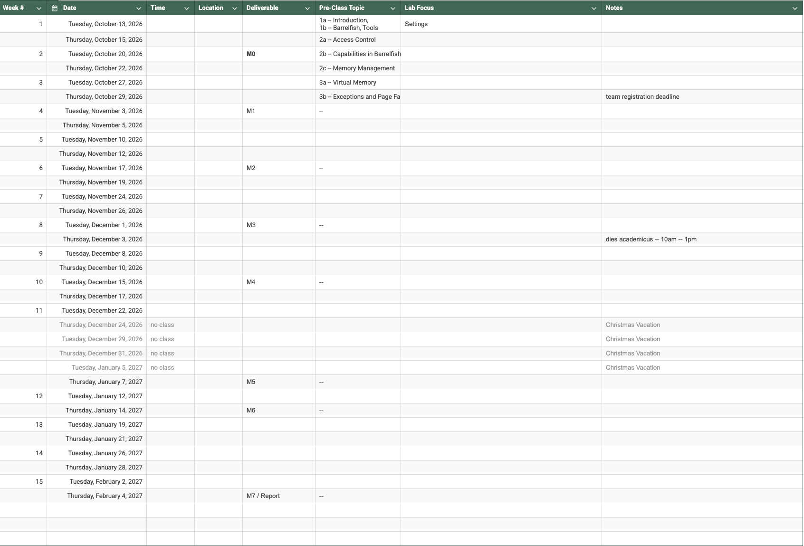

# OSDI-LAB Schedule -- Winter 2026

The course consists of a series of pre-recorded videos, lab sessions, and milestone presentations.

> [!IMPORTANT]
> Note that the course requires **mandatory** milestone presentations to the course staff during the course hours.

## Course Hours

 * TBD (~~Tuessday: 13:00 -- 16:00~~)
 * TBD (~~Thursday: 13:00 -- 16:00~~)

> [!IMPORTANT]
> Note: we generally assume that participants are free during the course hours.

## Schedule

**Lab Sessions**
 * Work on the project alone or with your team.
 * Attendance is optional, but highly recommended.

**Deadlines**
 * Typically at Noon on the day of the milestone presentation.

**Milestone Presentations**
 * Present your solution to a course staff.
 * Attendance is mandatory for everyone during their presentation slot.

> [!WARNING]
> Failure to show up without giving notice will result in a zero in the associated assignment.

**Video Lectures**
 * Pre-recorded videos will be released upfront.

**Term Schedule**
Schedule is also available as [Google Sheet](TBD).

